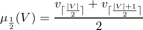

# atlas-median

Calculates the median of a set of data points in-place.

[](https://travis-ci.org/atlassubbed/atlas-median)

---

## install

```
npm install --save atlas-median
```

## why

Breaking up [atlas-dataset](https://github.com/atlassubbed/atlas-dataset#readme) into standalone functions. This module computes the median value over an array of numbers:

<p align="center">
  
</p>

## examples

#### unsorted array

The `median` function sorts the array in-place before taking the middle value. In the case of an even-length array, the median is the mean of the two middle values.

```javascript
const median = require("atlas-median")
console.log(median([4,3,1,2]))
// 2.5
```

#### sorted array

To avoid sorting a pre-sorted array, use a boolean flag:

```
...
console.log(median([1,2,3,4,5], true)) // fast
// 3
```
